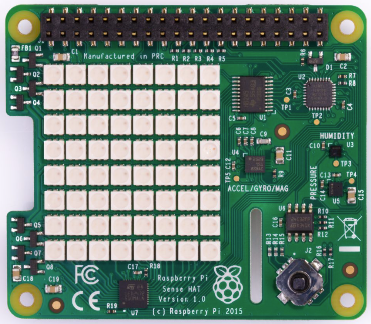

# Readme

## 1. Background

The Sense HAT is a great add-on board for Raspberry Pi 3 and 4, made especially for the Astro Pi mission. It comes with an `8x8 RGB LED matrix` and some sensors including `temperature`, `humidity` and `barometric pressure` which are widely used in IoT scenarios. 



Raspberry Pi officially created a **Python library** providing easy access to everything on the board. However, some developers are looking for running it in a docker container and especially working with Azure IoT Edge platform. 

I created this open-sourced sample for this purpose of use.

## Notes
Please be noted that this sample is **NOT** for production use.

## 2. Prerequisites

### 2.1 Development PC:
- Win10 Pro 19043 +
- Docker Desktop with WSL 2 base engine
- Python 3.7+
- Azure IoT Explorer
  - VS Code with extension:
  - Azure Account
  - Python
  - Azure IoT Tools
- Azure account:
  - Azure Global
  - Azure China
  - Azure IoT Hub
  - Azure IoT Edge

### 2.2 Target platform:
- Raspberry Pi 4B – Raspian OS Buster
- Sense HAT

Once assembled, it shall look like this:


### 2.3 Create a new Azure IoT Edge Solution on VS Code

You may follow this [tutorial](https://docs.microsoft.com/en-in/azure/iot-edge/tutorial-python-module?view=iotedge-2020-11) if you are new to Azure IoT Edge.

## 3. Start writing the main codes

### 3.1 Design the Microsoft Logo and Smile face

The module starts with Microsoft Logo displayed on the SenseHat LED display. The logo is shown on the dislplay while sending telemetry to Azure IoT Hub. 

Once completed, a smile face will be displayed on the Sensehat LED display for 5 seconds.

Refer to sample codes from [main.py](sources/getsensordata/main.py).

I use `set_pixel()` here.

### 3.2 Populate the Message for telemetry

You may use sense-hat library to access the sensor data. In this sample, we only use below three sensor APIs:
- `get_temperature()`
- `get_humidity()`
- `get_pressure()`

Please be noted the sensor data need to be formatted using `Message()` before sending to Azure IoT Hub.

Refer to below codes:
```
# Define message format
MSG_TXT = '{{"Temperature":{t}, "Humidity":{h}, "Pressure":{p}}}'
```

### 3.3 Use azure.iot.device.aio to send telemetry data

In this sample, I used `send_message()` method to send telemetry. This sample module sends 10 messages with sending interval 5 seconds.

## 4. Prepare the dockerfile, requirements.txt

It's important to add the necessary libraries.

To use SenseHAT, below dependencies are to be installed:

```
# Install dependencies to use sense-hat
RUN apt-get install -y \
    libatlas-base-dev \
    libjpeg62 \
    libopenjp2-7 \
    libtiff-tools \
    i2c-tools \
    libxcb1
```

Refer to the sample [dockerfile](sources/getsensordata/Dockerfile.arm32v7) and sample [requirements.txt](sources/getsensordata/requirements.txt).


## 5. Modify the deployment manifest

If you are new, you may follow this [tutorial](https://docs.microsoft.com/en-in/azure/iot-edge/tutorial-python-module?view=iotedge-2020-11).

The sample manifest can be found [HERE](sources/config/deployment.template.json).

## 6. Build and deploy the manifest

Follow above link to `docker build` and `docker push` the image to the RPi4.

## 7. View the deployment result

On RPi4, you may run `sudo iotedge list` to view the running modules.


While the module is running, you may use Azure IoT Explorer to view the logs:


On RPi4, you may also see the Microsoft Logo displayed while sending the message.


Once sending is completed, you may see the smile face shown up for 5 seconds.


#

<THE END>

